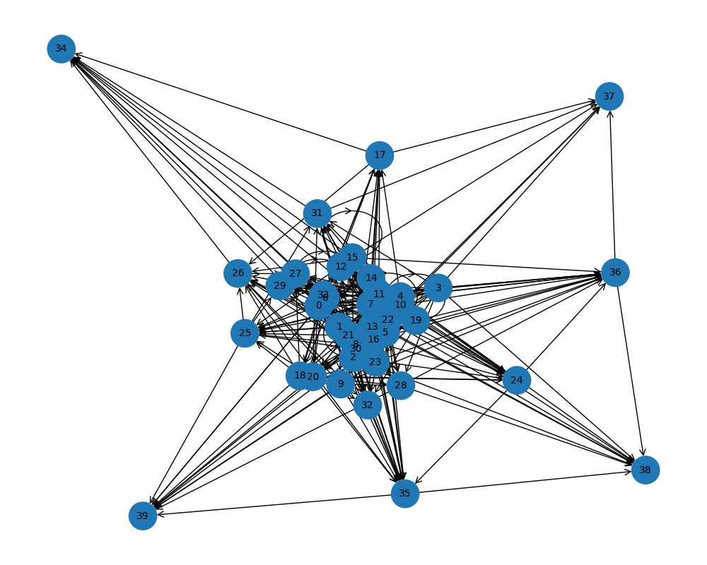

# irsanai-mom4ai-forge

<p align="center">
  <a href="https://irsanai.github.io/irsanai-mom4ai-forge/">
    
  </a>
</p>

**Mom for AI** – Die evolutive Mutter-KI, die neue neuronale Netz-Architekturen gebiert.

### Live Demo (GitHub Pages)
https://irsanai.github.io/irsanai-mom4ai-forge/  
→ Schau dir Beispiele, Vision, Roadmap und Screenshots an

<p align="center">
  
  <br><small>Ein frühes Skelett – myzelartig verzweigt, schwarmartig verbunden</small>
</p>

### Vision
Eine KI, die **nicht kopiert** – sondern **neu erfindet**.  
Aus Myzel-Netzen, Ameisen-Schwärmen, Quorum Sensing & Slime Molds entstehen Graph-Skelette, die später zu Chat-Modellen werden.  
Nur Skelette mit starker Auto-Fitness (Dichte, Modularität, Feedback) überleben.

Ziel: Neue, resonanzstarke Architekturen für die nächste Generation von AI.

### Aktueller Stand (März 2026)
- Graph-basierte Skelett-Generierung mit networkx
- Auto-Fitness ohne User-Input
- Speichern/Laden von Skeletten (JSON)
- Automatische PNG-Visualisierung

### Schnellstart
```bash
pip install -r requirements.txt
python src/mom_forge.py