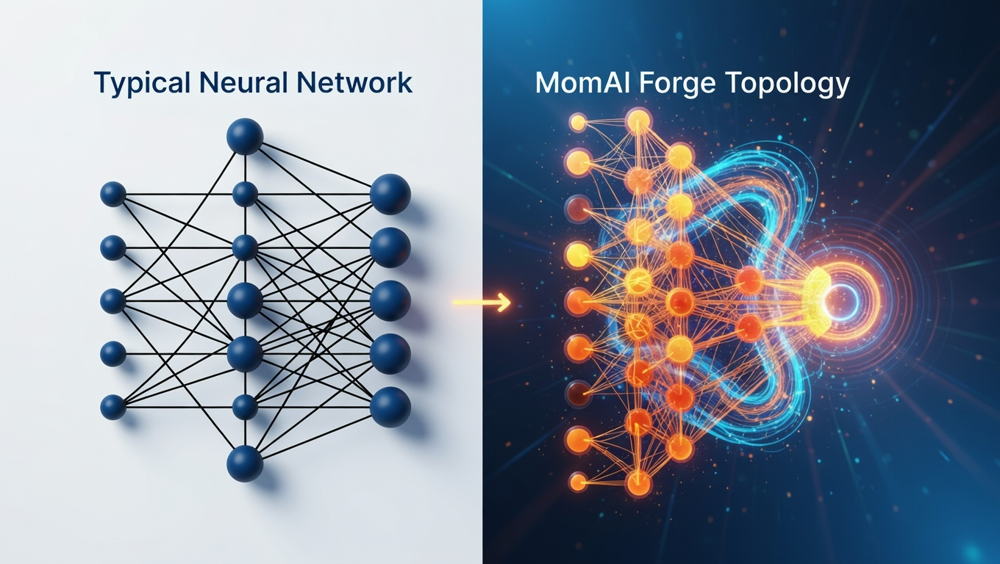

  

    <section class="hero-card">
      <h1>Mom4AI Forge — Live Evolution Lab</h1>
      
Keine statische Modell-Liste, sondern ein lebendiges Ökosystem aus bio-inspirierten Netz-Skeletten mit kontinuierlicher Selektion.

      
Die Grafik zeigt den Kern-Claim: klassisches Feedforward-Netz vs. evolutive MomAI-Topologie.

      
    </section>

    <aside class="hero-card cta-box">
      

        <h2 style="margin-top:0;">Join the Forge</h2>
        
Generiere eigene Skelette, pushe sie ins Repo und sieh zu, wie sie in der Hall of Fame auftauchen.

        
Online läuft die öffentliche Hall of Fame. Für Runtime-APIs/Sessions lokal starten:

        <code>python src/live_dashboard_server.py</code>
      

      <a class="cta-button" href="https://github.com/IrsanAI/irsanai-mom4ai-forge">Mitbauen auf GitHub</a>
    </aside>
  

  <section class="panel" style="padding:0.9rem;">
    <h2 style="margin:0.2rem 0 0.6rem;">Live Evolution – Hall of Fame</h2>
    

      

Gesamt Skelette

…

      

Contributor

…

      

Resonant

…

      

Emerging

…

      

Non-resonant

…

      

Seltenste Geburt

…

    

    

      <input type="text" id="search" placeholder="Suche Name, User, Dominant Type…">
      <select id="sort">
        <option value="fitness-desc">Fitness ↓</option>
        <option value="fitness-asc">Fitness ↑</option>
        <option value="born-desc">Born count ↓</option>
        <option value="born-asc">Born count ↑</option>
      </select>
      <button id="refresh-btn">Aktualisieren</button>
    

    

  </section>

  <section class="meta-grid">
    <article class="panel" style="padding:0.9rem;">
      <h3 style="margin:0;">Top 5 Gesamt (Fitness)</h3>
      <ol id="top-5-list"></ol>
    </article>
    <article class="panel" style="padding:0.9rem;">
      <h3 style="margin:0;">Seltenste Skelette (born_count ≤ 1)</h3>
      <ul id="rare-list"></ul>
    </article>
    <article class="panel" style="padding:0.9rem;">
      <h3 style="margin:0;">Top Contributor Ranking</h3>
      <ul id="contributors-list"></ul>
      
🏆 Legendär = Top1 • 🥈 Aufstrebend = Top2/3 • 🌱 Newcomer = alle weiteren

    </article>
    <article class="panel" style="padding:0.9rem;">
      <h3 style="margin:0;">Dominante Bio-Typen</h3>
      <ul id="dominant-list"></ul>
    </article>
  </section>

  <section class="panel tree-panel" style="padding:0.9rem;">
    <h3 style="margin-top:0;">Vis.js Evolution-Tree (Hall of Fame)</h3>
    

      Visualisiert die Evolution der Top-Skelette als interaktiven Graphen.
      Linien verbinden einen Eintrag mit einem plausiblen Vorgänger (gleicher Contributor, niedrigere Generation) als Lineage-Proxy.
    

    

  </section>

  <section class="panel" style="padding:0.9rem; margin-top:0.4rem;">
    <h3 style="margin-top:0;">Local Runtime / Sync Monitor</h3>
    
Warte auf lokalen Server…

    
Git Sync: -

    
Session: -

    
Stream: -

  </section>

  
<small>Hinweis: Auf GitHub Pages ist nur der Online-Modus aktiv; lokale Runtime-APIs sind absichtlich deaktiviert.</small>

  

    <button id="close-modal" style="float:right;">Schließen</button>
    <h3 id="detail-title">Skeleton Detail</h3>
    <pre id="detail-json" style="white-space:pre-wrap; font-size:0.86rem;"></pre>
  

