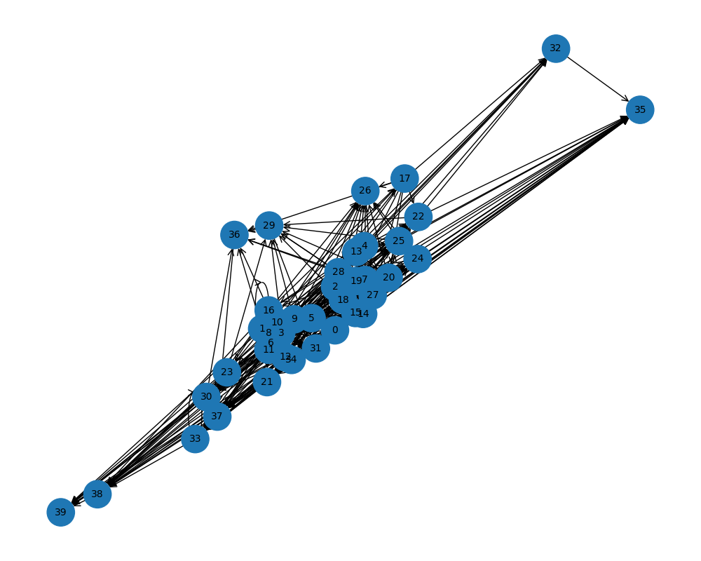
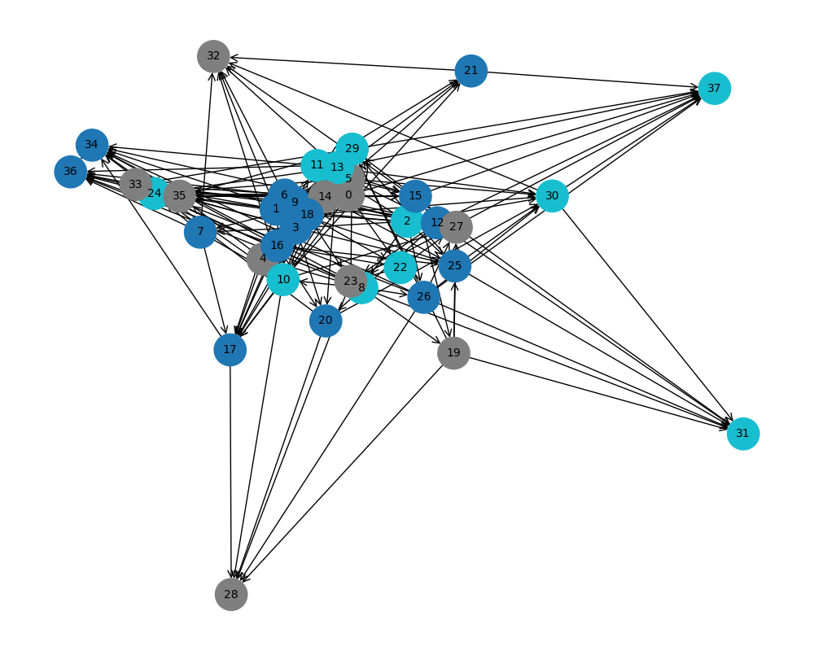

  <h1 style="color: #0f0; font-family: 'Courier New', monospace;">Mom4AI Forge</h1>
  
Die KI-Mutter, die neue neuronale Netze gebiert.

## Vision

Eine evolutive KI, die **nicht kopiert** – sondern **neu erfindet**.  
Aus Myzel-Netzen, Ameisen-Schwärmen, Quorum Sensing & Slime Molds entstehen Graph-Skelette.  
Nur die mit starker Auto-Fitness (Dichte, Modularität, Feedback-Loops) überleben.

  
   <small>Ein frühes Skelett – myzelartig verzweigt, schwarmartig verbunden</small>

## Wie es funktioniert

1. Mom mischt Bio-DNA (0–100 %)
2. Erzeugt Graph-Skelett (Knoten = Layer-Typen, Kanten = Verbindungen)
3. Bewertet automatisch (Fitness-Score)
4. Überlebende werden gespeichert & können mutiert werden

## Aktueller Stand

- Graph-Generierung mit networkx
- Auto-Fitness (Dichte, Modularity, Feedback)
- Speichern/Laden & PNG-Visuals
- Erste Generationen laufen

## Roadmap

- Mutation & Crossover von Skeletten
- Aus Graph → echtes Mini-Transformer-Chat-Modell
- Echte User-Resonance durch Chatten
- Skalierung auf Server (mehr Knoten, echte Training)

## Beispiele (aus Runs)

  
  

Made with ❤️ by [IrsanAI](https://github.com/IrsanAI)  
[Repo](https://github.com/IrsanAI/irsanai-mom4ai-forge) • [X/Twitter] • [Discord?]
